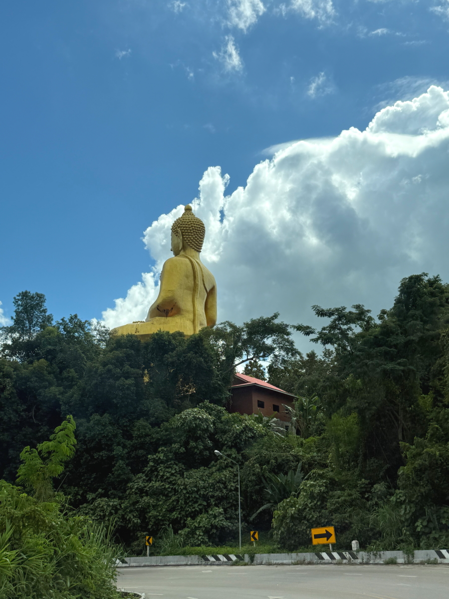
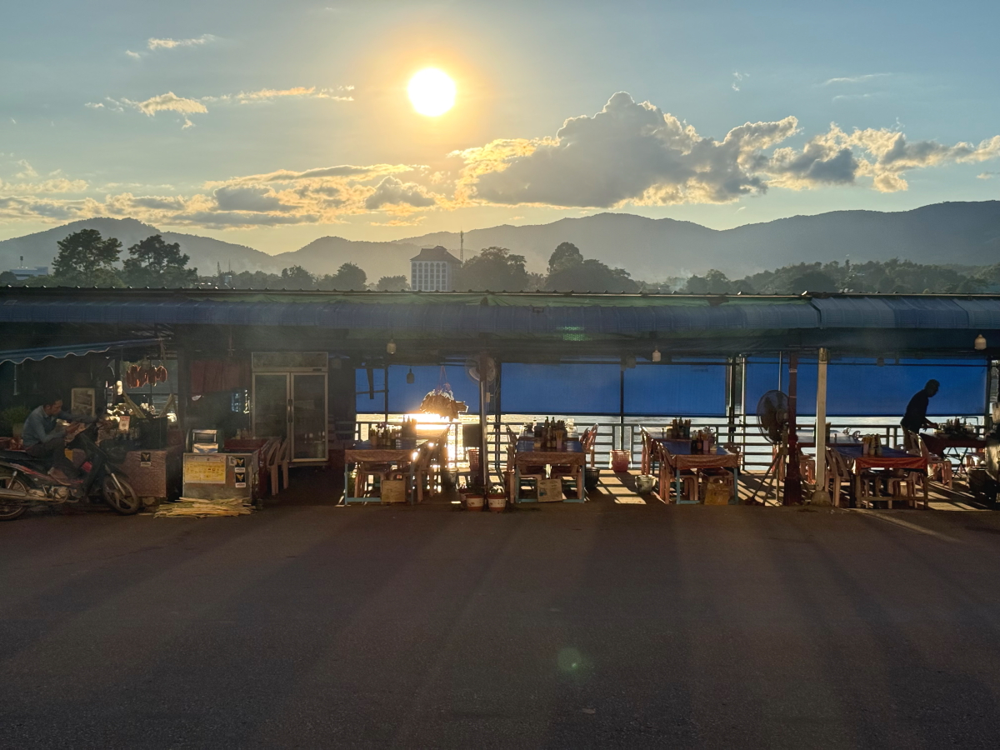
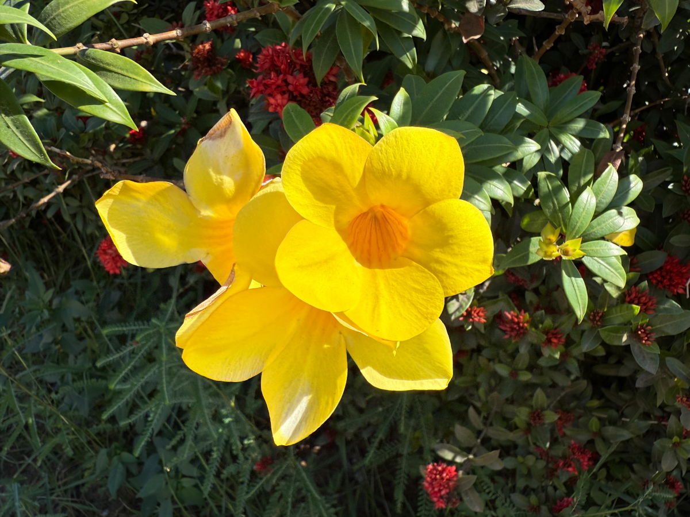

# 20251026_maechan

<html lang="ja" data-loaded="false" data-scrolled="false" data-spmenu="closed">
<head>

<meta charset="UTF-8">
<meta http-equiv="Content-Type" content="text/html; charset=UTF-8">
<meta http-equiv="X-UA-Compatible" content="IE=EmulateIE10" />
<meta http-equiv="X-UA-Compatible" content="IE=edge">

<meta name="viewport" content="width=device-width, initial-scale=1.0">

<!--ここから上はお決まりの定型文です-->

<!--ここからが表現の書式などを決めるcssという部分-->

<link href="https://cdnjs.cloudflare.com/ajax/libs/lightbox2/2.7.1/css/lightbox.css" rel="stylesheet">

</head>

<body>
    
<!--
    
<a href="https://torokoid.github.io/20250927_maechan/">Happy Birthday</a>><a href="https://torokoid.github.io/20250927__maechan/">Polis's Home></a>Polis's Home_2

-->

モバイル端末をお使いの場合は、画面を横向きにすると
背景画像の横方向がご覧頂けます。

<!--ここ上は、ほぼそのまま使います！-->

<!--QRコードの挿入例-->

 QR for Access

<marquee direction="left" scrollamount="20" width="30%">(^_^)/~Hada</marquee>

<!--流れ文字の挿入例-->
<h1><marquee behavior="left">!!! 2025/10/25-26 、ラオスに向かう国道から、メコン川の夕暮れとラオスの市場まで !!!</marquee></h1>

                          

<!--ここから下が、本体部分-->
    

<h2>25,Oct,2025 国道を東進してラオスとの国境の街に向かいます</h2>

<h2>陽射しが強くて道路の痛みが早いみたいで、道路工事はかなり頻繁</h2>

    
<h2>GSに来る様々なクルマ達</h2>

    
<h2>一家総出でお出かけ中の様子</h2>

    
<h2>最後の峠を越えると、メコン川流域の地帯に出ます</h2>

    
<h2>メコン川が見え始めました</h2>

    
<h2>周辺の山の斜面もタイの穀倉地帯</h2>

    
<h2>メコン川を見下ろして、ラオス側を見つめる仏像様</h2>

    
<h2>タイ側の国境の街</h2>

    
<h2>左折するとメコン川を渡る国境の橋</h2>

    
<h2>国境の橋の西端、タイ側の入管の建物です</h2>

    
<h2>出国手続きのゲートでパスポートにスタンプをもらいます</h2>

    
<h2>手続きが終わってゲートをくぐった先のバス乗り場</h2>

    
<h2>バスでメコン川を渡れば、ラオス領内</h2>

    
<h2>ラオスの入管で入国手続き</h2>

    
<h2>入国した先のタクシー乗り場</h2>

    
<h2>ラオス側、国境の街の案内図</h2>

    
<h2>お土産屋さんもありました</h2>

    
<h2>ラオス側入管の建物</h2>

    
<h2>ラオス側の空に湧き立つ、入道雲</h2>

    
<h2>タクシーのシフトレバーが日本刀のつか</h2>

    
<h2>ラオス側は右側通行です</h2>

    
<h2>このホテルに2泊します</h2>

    
<h2>山の斜面側の部屋だったのを、川側に変えてもらって、部屋からメコン川を眺めます</h2>

    
<h2>タイ側の仏像様がこちらを見ています</h2>

    
<h2>皮魚を獲る船</h2>

    
<h2>25日の晩御飯は、宿の前の屋台</h2>

    
<h2>サトウキビを絞ったジュースが美味しかったです</h2>

    
<h2>タイ側に沈む夕陽</h2>

    
<h2>夕焼け空が見事に割れました</h2>

    
<h2>26,Oct,2025 この日も朝から晴天</h2>

    
<h2>ベンツに乗れる富裕層も屋台でお買い物</h2>

    
<h2>ロビーでくつろぐのは宿の経営者の家族</h2>

    
<h2>ラオスのお花も見事です</h2>

    
<h2>宿の裏の丘を越えて市場に向かう途中、丘の上からの眺めが見事</h2>

    
<h2>滅多に来れないので記念撮影</h2>

    
<h2>広場の木の幹がツタで覆われて見事です</h2>

    
<h2>その木の前でも記念撮影</h2>

    
<h2>民家のお花達も咲き誇っています</h2>

    
<h2>宿から15分ほど歩いて、市場に到着</h2>

    
<h2>お昼は市場横の食堂</h2>

    
<h2>市場内にも食堂がありました</h2>

    
<h2>おねだりの猫ちゃん</h2>

    
<h2>市場の虫除けの仕組みが、昔の日本と同じ</h2>

<iframe width="560" height="315" src="https://www.youtube.com/embed/xF7kDP-NwkQ?si=mTha63o7Ic-6ap6g" title="YouTube video player" frameborder="0" allow="accelerometer; autoplay; clipboard-write; encrypted-media; gyroscope; picture-in-picture; web-share" referrerpolicy="strict-origin-when-cross-origin" allowfullscreen></iframe>
    

<h2>帰り道、トラックが道を塞いで立ち往生</h2>

    
<h2>丘の頂上には、携帯の基地局</h2>

    
<h2>丘を越えた先は、メコン川流域のエリア</h2>

    
<h2>ここからの眺めも見事なので一枚パチリ！</h2>

    
<h2>宿からは見えない、タイの北方のお寺も見えました</h2>

    
<h2>塀の上にガラスを立てる、日本でも昔見た光景</h2>

    
<h2>宿の部屋から見えるメコン川が綺麗</h2>

    
<h2>今回の移動エリアをGPSでプロット</h2>

    

    

  
<h2>心配していた通信事情もかなり細いですが、HP作成は時間をかけて実施できたみたいです</h2>

    

    
<!--

<iframe width="560" height="315" src="https://www.youtube.com/embed/51tmW4PV-Xw?si=v7PtzTJ3WaY8o6uJ" title="YouTube video player" frameborder="0" allow="accelerometer; autoplay; clipboard-write; encrypted-media; gyroscope; picture-in-picture; web-share" referrerpolicy="strict-origin-when-cross-origin" allowfullscreen></iframe>
    

<iframe width="560" height="315" src="https://www.youtube.com/embed/MvsoLLa-XHQ?si=-zvqXbodBPV2nEFE" title="YouTube video player" frameborder="0" allow="accelerometer; autoplay; clipboard-write; encrypted-media; gyroscope; picture-in-picture; web-share" referrerpolicy="strict-origin-when-cross-origin" allowfullscreen></iframe>
    

<h2>Short movies</h2>
https://youtube.com/shorts/773yijDWNEM?feature=share 
https://youtube.com/shorts/fXWujjVeAQo?feature=share 
https://youtube.com/shorts/43kwtgxybM8?feature=share 
https://youtube.com/shorts/jKhX0RtXWAk?feature=share 
https://youtube.com/shorts/Fqw8KGuUPtA?feature=share 
https://youtube.com/shorts/ieJlzaTlpn0?feature=share 
https://youtube.com/shorts/z8YXZQyPVMA?feature=share 
https://youtube.com/shorts/1MxKGMEFFR4?feature=share 
-->

         

  
<h2>今日のBGMは รวมเพลงเก่าฟังเพลิน ยุค 70-90 จากออร์แกน ไฟล์มาสเตอร์ล่าสุด</h2>

<iframe width="560" height="315" src="https://www.youtube.com/embed/a_5IEDkY_1M?si=I9-fu7aIIeEi6fww" title="YouTube video player" frameborder="0" allow="accelerometer; autoplay; clipboard-write; encrypted-media; gyroscope; picture-in-picture; web-share" referrerpolicy="strict-origin-when-cross-origin" allowfullscreen></iframe>
    

    
    
    

   
<h2>ラオスに向かう国道から、メコン川の夕暮れとラオスの市場まででした Thank you for reading this far.</h2>

     
<h2>
<a href="https://torokoid.github.io/Mashiko_himawari_3/" target="_blank">クリックでメニューページに戻ります</a>
</h2>

    

   

<!-- hitwebcounter Code START -->
<a href="https://www.hitwebcounter.com" target="_blank">

you are visitor The numbers are cumulative for the Bangkok series websites launched since August 1st.
</a>   

         

  

      

<!--本体はここまで-->

<!--画面に空白地帯を作って、背景が見えるようにしています-->
                                              

<!-- フッタ -->
<footer>

Copyright 2025/10/26 S,Hada @Mae Chan

</footer>

<!--HPにさまざまなJavaScriptを呼び込むための書式-->

    
    </body>
    
</html>
